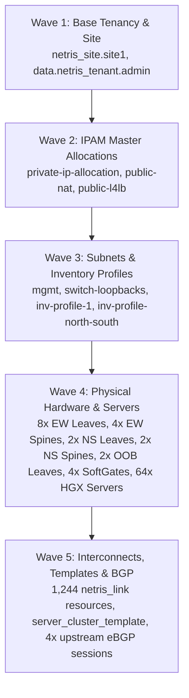

# Annotated Technical Breakdown: 2-Tier NVIDIA Spectrum-X AI Cluster & Netris Fabric

> **ADHD Quick-Take**: This OpenTofu/Terraform codebase is a mathematical factory. From a single variable (`gpu-server-count = 64`), it procedurally computes, cables, and configures an entire dual-plane AI datacenter fabric consisting of **16 switches, 4 SoftGate appliances, 64 HGX GPU servers, and 1,244 physical links**, provisioning RoCEv2 Adaptive Routing, unnumbered BGP underlays, and external eBGP peering via the Netris Controller.

---

## 1. Fabric Architecture & Topology Map

An NVIDIA Spectrum-X deployment requires strict separation between **backend GPU inter-node traffic** (RoCEv2) and **frontend cluster services** (storage, control plane, internet/WAN transit).

```mermaid
graph TD
    subgraph WAN ["External Border / Transit"]
        Border["Upstream Transit Router<br/>(AS 65401)"]
    end

    subgraph Edge ["Netris SoftGate Appliances (DPDK/eBPF Gateway)"]
        SG0["ns-softgate-0 (general)"]
        SG1["ns-softgate-1 (general)"]
        SG2["ns-softgate-2 (snat)"]
        SG3["ns-softgate-3 (snat)"]
    end

    subgraph NS_Fabric ["North-South Fabric (Frontend, Ingress & Management)"]
        NSSpine["2x NS Spines<br/>(ns-spine-0..1)"]
        NSLeaf["2x NS Leaves<br/>(ns-leaf-0..1)<br/>4x200G Breakout"]
        NSOOB["2x OOB Leaves<br/>(ns-oob-leaf-0..1)<br/>54 Ports 1G/10G"]
        
        NSSpine <-->|16 Links (/31)| NSLeaf
        NSSpine <-->|4 Links (/31)| NSOOB
    end

    subgraph EW_Fabric ["East-West Fabric (Spectrum-X RoCE Backend GPU Network)"]
        EWSpine["4x EW Spines<br/>(spine-0..3-pod00)<br/>2x400G Breakout (128 ports)"]
        EWLeaf["8x EW Leaves<br/>(leaf-pod00-su*-r*)<br/>2x400G Breakout (128 ports)"]
        
        EWSpine <-->|512 Links: Full Non-Blocking Mesh| EWLeaf
    end

    subgraph Compute ["64x HGX GPU Servers (11 Network Interfaces Each)"]
        HGX["HGX Server (hgx-pod00-su*-h*)<br/>8x 400G RoCE NICs + 2x Frontend NICs + 1x IPMI"]
    end

    Border <-->|4x eBGP Peering (upstream1..4)| Edge
    Edge <-->|8 Links (eth1/eth2)| NSLeaf
    
    EWLeaf <-->|"512 Links: eth1..eth8 (8 RoCE Rails)"| HGX
    NSLeaf <-->|"128 Links: eth9, eth10 (L2VPN Gateway)"| HGX
    NSOOB <-->|"64 Links: eth11 (IPMI/BMC L2VPN)"| HGX
```

---

## 2. Cluster Sizing & Mathematical Mechanics

### 2.1 The Derivation Hierarchy
Every switch count, IP subnet, and link calculation is derived dynamically from `var.gpu-server-count` (currently set to `64`):

$$\text{EW Leaf Count} = \frac{\text{gpu-server-count}}{8} = \frac{64}{8} = 8 \text{ Leaves}$$

$$\text{EW Spine Count} = \frac{\text{gpu-server-count}}{16} = \frac{64}{16} = 4 \text{ Spines}$$

$$\text{EW Leaf-to-Spine Links} = 8 \text{ Leaves} \times 64 \text{ Uplinks} = 512 \text{ Links}$$

$$\text{EW Leaf-to-Server Links} = 64 \text{ Servers} \times 8 \text{ RoCE NICs} = 512 \text{ Links}$$

$$\text{Oversubscription Ratio} = \frac{512 \text{ Downlinks (400G)}}{512 \text{ Uplinks (400G)}} = 1:1 \text{ (Full Non-Blocking)}$$

---

### 2.2 Demystifying the "Terrifying Math"
In `east-west.tf` and `north-south.tf`, you encounter formulas such as:
```hcl
ports = [
  "swp${(floor((count.index - ((netris_switch.east-west-leaf[0].portcount) * floor(count.index / (netris_switch.east-west-leaf[0].portcount))) + (netris_switch.east-west-leaf[0].portcount)) / 2) + 1)}s${(count.index - (2 * (floor(count.index / 2))))}@${netris_switch.east-west-leaf[(floor(count.index / (netris_switch.east-west-leaf[0].portcount)))].name}",
  "swp...s...@spine"
]
```

#### Why does it look like this?
In standard Terraform, connecting 512 cables would require 512 manual resource blocks. Here, the author unrolls a **2-dimensional cabling matrix** into a single 1D `count` loop ($0 \dots 511$):

1. **Which Switch?**
   $$\text{switch\_index} = \left\lfloor \frac{\text{count.index}}{\text{ports\_per\_switch}} \right\rfloor$$
   `floor(count.index / 64)` maps iterations $0\dots63$ to Switch 0, $64\dots127$ to Switch 1, etc.

2. **Which Physical QSFP Port?**
   Each physical switch port supports `2x400G` breakout (splitting 1 port into 2 sub-ports: `s0` and `s1`):
   $$\text{port\_number} = \left\lfloor \frac{\text{local\_port\_index}}{2} \right\rfloor + 1$$
   Maps pairs of connections to physical ports `swp1` through `swp64`.

3. **Which Breakout Lane (`s0` vs `s1`)?**
   $$\text{lane} = \text{count.index} \pmod 2 = \text{count.index} - 2 \times \left\lfloor \frac{\text{count.index}}{2} \right\rfloor$$
   Even index = lane `s0`; Odd index = lane `s1`.

4. **Point-to-Point `/31` Subnet Calculation:**
   Point-to-point switch links use RFC 3021 `/31` subnets (2 usable IPs: even IP on one end, odd IP on the other):
   * End A: `10.254.X.(2 * index)/31`
   * End B: `10.254.X.(2 * index + 1)/31`

---

### 2.3 The 8 RoCE "Rails" (`second-octet`)
```hcl
second-octet = [16, 18, 20, 22, 24, 26, 28, 30]
```
In an NVIDIA SuperPOD HGX architecture, each GPU server contains **8 independent RoCE network adapters** (`eth1` through `eth8`), one for each GPU:
* **Rail 0 (`eth1`)** $\rightarrow$ `172.16.x.x`
* **Rail 1 (`eth2`)** $\rightarrow$ `172.18.x.x`
* **Rail 2 (`eth3`)** $\rightarrow$ `172.20.x.x`
* **Rail 3 (`eth4`)** $\rightarrow$ `172.22.x.x`
* **Rail 4 (`eth5`)** $\rightarrow$ `172.24.x.x`
* **Rail 5 (`eth6`)** $\rightarrow$ `172.26.x.x`
* **Rail 6 (`eth7`)** $\rightarrow$ `172.28.x.x`
* **Rail 7 (`eth8`)** $\rightarrow$ `172.30.x.x`

**Pre-Sales / Technical Rationale:** GPU collective operations (NCCL AllReduce / AllToAll) transmit identical rail data simultaneously. By assigning each GPU interface to an isolated subnet and switch path, the fabric completely eliminates **inter-rail hash collisions** and traffic head-of-line blocking.

---

## 3. Block-by-Block Annotated Breakdown

### Core Fabric Setup (`terraform.tf`, `netris-site_override.tf`, `server-cluster-template.tf`)

#### Block: `resource "netris_site" "site1"`
```hcl
resource "netris_site" "site1" {
  name                = var.site-name
  publicasn           = var.site.publicasn
  acldefaultpolicy    = var.site.acldefaultpolicy
  vlanrangeautoassign = var.site.vlanrangeautoassign
}
```

| Aspect | Explanation |
|---|---|
| **What it represents** | The physical datacenter boundary (`Datacenter-A`) where switches, subnets, and routing policies live. |
| **OpenTofu Engine Logic** | Root anchor in the Directed Acyclic Graph (DAG). Provides `netris_site.site1.id` to every switch, subnet, and SoftGate. |
| **Netris Controller Impact** | Registers the site in the Netris Controller DB. Binds BGP Autonomous System Number (ASN `655001`) to the site. |
| **Key Attributes** | `publicasn = 655001`: Site BGP ASN.<br/>`acldefaultpolicy = "permit"`: Hardware ACL permit baseline.<br/>`vlanrangeautoassign = "2-3999"`: EVPN VXLAN VNIs and VLAN reservation pool. |
| **Gotcha / ADHD Pro-Tip** | `netris-site_override.tf` explicitly sets `rohasn = null`, `vmasn = null`, and `sitemesh = null` because Spectrum-X RoCE fabrics use direct unnumbered BGP underlays rather than RoH (Routing-on-Host). |

---

#### Block: `resource "netris_serverclustertemplate" "server_cluster_template"`
```hcl
resource "netris_serverclustertemplate" "server_cluster_template" {
  name  = "server-cluster-template"
  vnets = jsonencode([ ... ])
}
```

| Aspect | Explanation |
|---|---|
| **What it represents** | Standardized network interface profile for all 64 HGX GPU servers. |
| **OpenTofu Engine Logic** | Independent resource that defines the multi-tenant VNet service mappings. |
| **Netris Controller Impact** | Instructs Netris how to orchestrate automated VNets across server interfaces when servers are joined to the cluster. |
| **Key Attributes** | `eth1-eth8`: L3VPN, untagged (East-West RoCE backend).<br/>`eth9-eth10`: L2VPN, gateway `192.168.7.254/21` (North-South frontend/data ingress).<br/>`eth11`: L2VPN, gateway `192.168.15.254/21` (Out-of-band IPMI / BMC management). |
| **Gotcha / ADHD Pro-Tip** | Ensure server interface names on bare metal (`eth1`..`eth11`) match this template exactly. Mismatched interface names will fail auto-binding. |

---

### Backend RoCE Fabric (`east-west.tf`)

#### Block: `resource "netris_inventory_profile" "inv-profile-1"`
```hcl
resource "netris_inventory_profile" "inv-profile-1" {
  name = "East-West"
  fabricsettings {
    optimisebgpoverlay    = true
    unnumberedbgpunderlay = true
  }
  gpuclustersettings {
    roceadaptiverouting  = true
    congestioncontrol    = true
    aggregatel3vpnprefix = true
  }
}
```

| Aspect | Explanation |
|---|---|
| **What it represents** | System and NOS configuration template applied to all East-West Spectrum-X switches. |
| **OpenTofu Engine Logic** | Upstream dependency for `netris_switch.east-west-leaf` and `spine`. Its ID is passed to switches via `profileid`. |
| **Netris Controller Impact** | Automatically configures Cumulus NVUE on the physical switches: sets up RFC 5549 BGP unnumbered underlay, enables hardware RoCE Adaptive Routing, and enables ECN/PFC congestion management. |
| **Key Attributes** | `roceadaptiverouting = true`: Spectrum-X dynamic per-packet load balancing.<br/>`congestioncontrol = true`: Hardware PFC / ECN buffer thresholds.<br/>`unnumberedbgpunderlay = true`: Switches establish BGP peering over IPv6 link-local addresses without consuming IPv4 subnets. |
| **Gotcha / ADHD Pro-Tip** | Do not change `roceadaptiverouting` on live switches without pausing training jobs, as buffer queue profiles are reloaded on the switch ASICs. |

---

#### Block: `resource "netris_switch" "east-west-leaf"` & `"east-west-spine"`
```hcl
resource "netris_switch" "east-west-leaf" {
  count     = local.leaf-count  # 8
  name      = "leaf-pod00-su${floor(count.index / 4)}-r${(count.index - (4 * floor(count.index / 4)))}"
  nos       = "cumulus_nvue"
  asnumber  = local.leaf-asn-start + count.index  # 4200100001..4200100008
  portcount = 64
  breakout  = "2x400"
}
```

| Aspect | Explanation |
|---|---|
| **What it represents** | The 8 physical leaf switches and 4 physical spine switches making up the 2-tier CLOS RoCE fabric. |
| **OpenTofu Engine Logic** | Uses `count = 8` (leaves) and `count = 4` (spines). Dynamically calculates loopback IPs via `cidrhost()` and unique private 4-byte ASNs. |
| **Netris Controller Impact** | Creates switch hardware inventory objects in Netris. Pushes base loopback addresses, BGP ASN, and breakout configuration (`2x400G`) down to Cumulus NVUE. |
| **Key Attributes** | `nos = "cumulus_nvue"`: Network Operating System type.<br/>`breakout = "2x400"`: Transforms 64 physical 800G ports into 128 logical 400G ports.<br/>`netris-switch-roles_override.tf`: Sets `role = "leaf"` and `role = "spine"`. |
| **Gotcha / ADHD Pro-Tip** | Depends explicitly on `netris_subnet.mgmt` and `netris_subnet.switch-loopbacks`. If subnets are missing, IP assignment will fail during controller registration. |

---

#### Block: `resource "netris_server" "hgx"`
```hcl
resource "netris_server" "hgx" {
  count      = var.gpu-server-count # 64
  name       = "${var.gpu-server-hostname}-pod00-su${...}-h${...}"
  portcount  = 16
  customdata = <<EOF
{
  "network": {
    "eth1": { "routes": ["172.16.0.0/15", "172.16.0.0/12"], "mtu": 9216 },
    ...
  }
}
EOF
}
```

| Aspect | Explanation |
|---|---|
| **What it represents** | Logical representation of 64 HGX 8-GPU servers registered into Netris. |
| **OpenTofu Engine Logic** | Generates 64 individual server resources with JSON network route tables in `customdata`. |
| **Netris Controller Impact** | Creates the compute inventory in Netris and prepares the host interfaces for automated network attachment. |
| **Key Attributes** | `portcount = 16`: Accommodates up to 16 network interfaces per server.<br/>`mtu: 9216`: Jumbo frames required for maximum RoCEv2 throughput and zero packet fragmentation.<br/>`routes`: Rail-specific subnet routing tables per interface. |
| **Gotcha / ADHD Pro-Tip** | `customdata` routes ensure Linux kernel RoCE traffic for Rail 1 (`eth1`) stays bound to the `172.16.0.0` subnet instead of leaking across other NICs. |

---

#### Block: `resource "netris_link" "leaf-to-spine"` & `"leaf-to-hgx"`
```hcl
resource "netris_link" "leaf-to-spine" {
  count = 512
  ports = [ ... ]
  ipv4  = [ ... ]
}
```

| Aspect | Explanation |
|---|---|
| **What it represents** | The physical interconnect matrix: 512 Leaf-Spine links + 512 Leaf-Server links = **1,024 RoCE backend cables**. |
| **OpenTofu Engine Logic** | Procedurally calculates cable endpoints and `/31` IPs using modulo and division arithmetic unrolling. |
| **Netris Controller Impact** | Programs switch ports in Netris, sets link speeds, configures `/31` IP interfaces, and enables unnumbered BGP underlay peering across all leaf-spine links. |
| **Key Attributes** | `underlay = "disabled"` on `leaf-to-hgx`: Tells Netris that server links are host-facing access/L3 ports, NOT internal fabric BGP routing links. |
| **Gotcha / ADHD Pro-Tip** | If you see link errors during `tofu apply`, check that switch breakout ports (`swp1s0`, `swp1s1`) match the actual physical transceivers inserted in the switches. |

---

### Frontend & Gateway Fabric (`north-south.tf` & `bgp.tf`)

#### Block: `resource "netris_softgate" "north-south-softgate"`
```hcl
resource "netris_softgate" "north-south-softgate" {
  count   = 4
  name    = "ns-softgate-${count.index}"
  flavor  = "sg-hs"
  role    = var.north-south-fabric.softgate-roles[count.index] # ["general", "general", "snat", "snat"]
}
```

| Aspect | Explanation |
|---|---|
| **What it represents** | 4 high-performance x86 DPDK/eBPF Software Gateway appliances providing border routing, SNAT, and L4 load balancing. |
| **OpenTofu Engine Logic** | Spawns 4 gateway nodes, binding them to North-South leaf switches via `netris_link.softgates-eth1` and `softgates-eth2`. |
| **Netris Controller Impact** | Provisions the SoftGate instances to manage routing between the private GPU cluster subnets and the external border transit network. |
| **Key Attributes** | `role = "general"`: Handles east-west/north-south routing, L4LB, and default gateway services.<br/>`role = "snat"`: Dedicated outbound Source NAT instances for high-throughput internet egress. |
| **Gotcha / ADHD Pro-Tip** | SoftGates require dual uplinks (`eth1` to Leaf 0, `eth2` to Leaf 1) for active-active high availability. |

---

#### Block: `resource "netris_bgp" "upstream1..4"`
```hcl
resource "netris_bgp" "upstream1" {
  name       = "upstream1"
  siteid     = netris_site.site1.id
  hardware   = "ns-softgate-0"
  neighboras = 65401
  localip    = "10.10.0.1/30"
  remoteip   = "10.10.0.2/30"
}
```

| Aspect | Explanation |
|---|---|
| **What it represents** | eBGP peering sessions established from each SoftGate node to upstream border transit routers (AS `65401`). |
| **OpenTofu Engine Logic** | Depends on `netris_softgate.north-south-softgate`. References SoftGate physical interfaces queried via `data.netris_network_interface.sg0..3`. |
| **Netris Controller Impact** | Generates FRR BGP peering configurations on the SoftGates, advertising public NAT/L4LB prefixes and receiving default routes (`0.0.0.0/0`). |
| **Key Attributes** | `neighboras = 65401`: Upstream transit ASN.<br/>`localip` / `remoteip`: Point-to-point `/30` BGP peering interconnect subnets. |
| **Gotcha / ADHD Pro-Tip** | Data sources `data.netris_network_interface.sg0..3` require `netris_switch.north-south-leaf` to exist first so switch ports are registered before BGP attaches to them. |

---

## 4. Execution Lifecycle & Dependency Waves

When running `tofu apply`, the OpenTofu engine executes the graph in **5 distinct dependency waves**:



---

## 5. Live Verification Commands

To inspect and verify this environment directly from `adam-ctl.netris.io`:

```bash
# 1. View summary count of all 1,352 resources in state
tofu state list | cut -d'.' -f1,2 | cut -d'[' -f1 | sort | uniq -c

# 2. Check all 16 physical switches registered in Netris
tofu state list | grep 'netris_switch\.'

# 3. Check BGP upstream sessions on the SoftGates
tofu state list | grep 'netris_bgp\.'

# 4. Inspect a single leaf-to-spine cabling link
tofu state show 'netris_link.leaf-to-spine[0]'

# 5. Verify the Server Cluster Template structure
tofu state show 'netris_serverclustertemplate.server_cluster_template'
```
