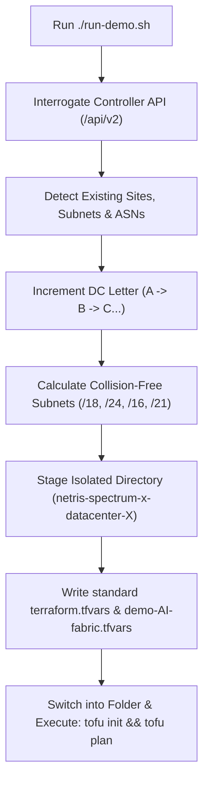

# Netris Spectrum-X CloudSim Demo Fabric

Dynamic, multi-cloud automated deployment for NVIDIA Spectrum-X switch fabrics on the Netris Controller.

This repository automatically inspects your active Netris Controller, detects existing deployments (`Datacenter-A`, `Datacenter-B`, etc.), avoids all IPAM, BGP ASN, and template collisions, creates an isolated data centre workspace, writes standard variables, and runs OpenTofu (`tofu init` and `tofu plan`) automatically.

---

## Architecture Overview



---

## Quick Start

### 1. Prerequisites
- Python 3
- OpenTofu (`tofu`) or Terraform (`terraform`)
- Access to your Netris Controller (local or remote)

### 2. Environment Variables (Optional)
If running outside localhost or using custom credentials:
```bash
export NETRIS_URL="https://your-controller.netris.io"
export NETRIS_USER="netris"
export NETRIS_PASS="your-password"
```

### 3. Deploy a New Data Centre
Run the deployer script:
```bash
./run-demo.sh
```

Or execute directly via Python:
```bash
python3 deploy-demo-fabric.py
```

### What Happens Automatically:
1. **Next Site Discovery**: It determines the next available data centre name (e.g. `Datacenter-B`, `Datacenter-C`).
2. **Subnet Conflict Avoidance**: Queries active IPAM subnets to guarantee no overlap in management, loopbacks, or GPU workload ranges.
3. **ASN Offset**: Queries existing switch hardware to allocate non-conflicting ASN blocks.
4. **Independent Workspace**: Creates an isolated directory `../netris-spectrum-x-<sitename>` with dedicated state.
5. **Standard Variables**: Writes standard `terraform.tfvars` (and `demo-AI-fabric.tfvars`), eliminating the need to pass `-var-file` flags.
6. **Automatic Plan**: Switches into the newly generated folder and executes `tofu init` followed by `tofu plan`.

---

## CLI Options

```bash
# Preview plan without interactive flags
python3 deploy-demo-fabric.py

# Force a specific letter (e.g. Datacenter-C)
python3 deploy-demo-fabric.py --letter C

# Target a remote controller explicitly
python3 deploy-demo-fabric.py --url http://adam-ctl.netris.io --user netris --password <PASSWORD>

# Automatically apply the configuration
python3 deploy-demo-fabric.py --apply

# Generate files and workspace without executing tofu
python3 deploy-demo-fabric.py --no-tofu
```
